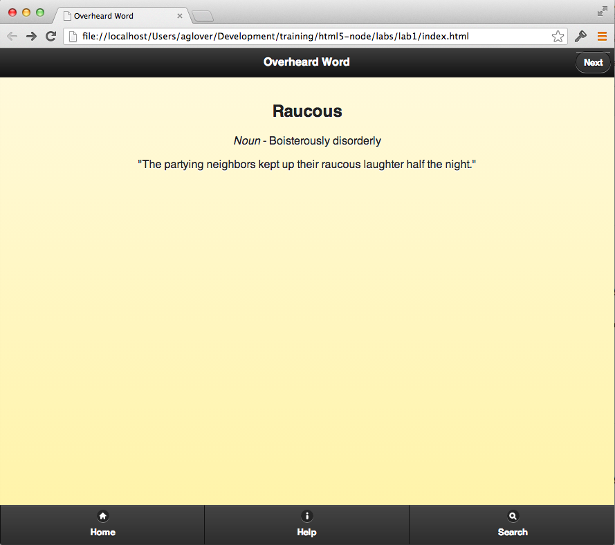
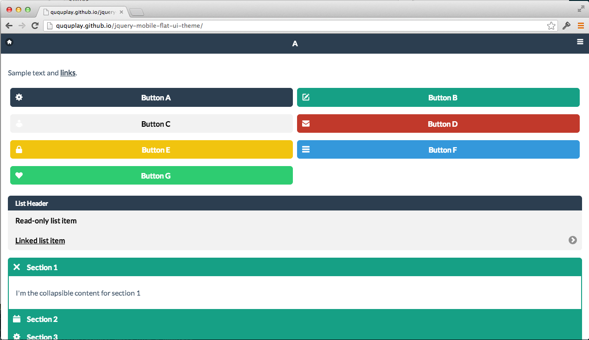

## Lab #1 

In Lab #1, you'll find an `index.html` file.  If you double-click it or open it with a modern browser (i.e _not_ IE) you should see a prototypical jQuery Mobile web app.



Go ahead and resize your browser window to make it more like a device (a phone or tablet, for example). 

Now take a look at the source code. 

#### Pages

In jQuery Mobile, a web page is delineated by a special `div`. In fact, it's defined by a `div` with a special attribute dubbed `data-role` with a value of `page`. For example, the definition for the page you see above is defined as:

```
<div data-role="page" id="page_1" data-theme='e'>
  <div data-theme="a" data-role="header">
    <h3>Overheard Word</h3>
  </div>

  <div data-role="content"> 
    <div class="center-wrapper">
      <h2>Raucous</h2>
      <p><em>Noun</em> - Boisterously disorderly</p>
      <p>"The partying neighbors kept up their raucous laughter half the night."</p>
    </div>
  </div>

  <div data-theme="a" data-role="footer" data-id="footer" data-position="fixed">
    <div data-role='navbar'>
      <ul>
        <li><a href='#' data-icon='home'>Home</a></li>
        <li><a href='#' data-icon='info'>Help</a></li>
        <li><a href='#' data-icon='search'>Search</a></li>
      </ul>
    </div>
  </div>
</div>
```

Look closely at the code above and note the various `div` attributes, in addition to `data-role`. `id` is helpful for linking as you'll see later. `data-theme` defines colors in jQuery Mobile.

Now look at the sub-`div`s of this page -- they also contain `data-role`s, and they are fairly self explanatory: `content` is, well, the content of the page and `footer` is...yes, you guessed it correctly: the footer of the page. Can you guess what `header` is? 

__Question__: How would you add another page to this app? Need a sample word? See [Merriam-Webster's Word of the Day](http://www.merriam-webster.com/word-of-the-day/).

#### Colors

By default, jQuery Mobile allows you to easily change the color scheme of a web app. You can get rather fancy with jQuery's [ThemeRoller](http://jquerymobile.com/themeroller/index.php) or you can simply change the values of `data-theme` within the various `div`s associated with a page.

__Question__: How would you change the colors of this app? Hint: the valid attribute values for `data-theme` are `a`, `b`, `c`, `d`, and `e`.

#### Themes

Now check out [jQuery Mobile Flat-UI Theme](https://github.com/ququplay/jquery-mobile-flat-ui-theme). 



Looks rather nice, right? Almost like iOS 7 or Windows Phone 8?

__Question__: How would you change the current web app to leverage it?

##### Parting thoughts

How do you navigate between pages in this app? See that __Next__ button on the top right or the __Back__ button on the top left (after you hit __Next__)? Is that an optimal way to navigate?
