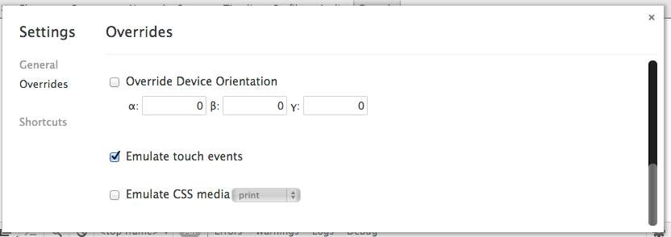

## Lab #2

In Lab #2, you will enhance the UX and the UI of the jQuery Mobile App from Lab #1. Mainly, you'll remove those non-snazzy navigation buttons and replae them with gestures; then, you'll refactor the footer of this app to use two custom icons (that is, you'll remove one button entirely and leave the app with only two).

Go ahead and open up the `index.html` file like you did in lab #1. 


Looking nice, eh? 

Try navigating back and forth in this app using the buttons on the top right and left. 

While navigation via buttons works and it's the traditional way of doing things on the desktop, mobile devices present new opportunities for engaging UX. That is, does a user really need to tap a button or can they use a simple gesture like a swipe? 

Of course, the answer is "Yes! You can use gestures!" 

#### Gestures

jQuery Mobile, being a mobile first framework, supports the usage of gestures -- all you have to do is plug 'em in. Open up the `index.html` file with your favorite editor and remove the old, pedestrian button logic and replace it with this logic:

```
$(document).on("pageinit", function(event) {
  $("div.ui-page").on("swipeleft", function() {
    var nextpage;
    console.log("swipeleft invoked");
    nextpage = $(this).next("div[data-role=\"page\"]");
    if (nextpage.length > 0) {
      return $.mobile.changePage(nextpage, "slide", false, true);
    }
  });
  return $("div.ui-page").on("swiperight", function() {
    var prevpage;
    console.log("swiperight invoked");
    prevpage = $(this).prev("div[data-role=\"page\"]");
    if (prevpage.length > 0) {
      return $.mobile.changePage(prevpage, {
        transition: "slide",
        reverse: true
      }, true, true);
    }
  });
});
```

Don't just blindly do this, by the way. Study the code -- what does it do? Also be careful where you add this code! It _must_ come after the inclusion of jQuery but before the inclusion of jQuery Mobile!

Once you've added this logic, how can you test it? 

If you have Chrome, open up the JavaScript Console and then click the button right gear icon. Find the option dubbed __Emulate Touch Events__ and check it. 



Also note the JavaScript code from earlier -- there are calls to `console.log`. You can see that output in the JavaScript Console.

#### Custom icons

Take a look in the `images` directory. There are two icons in there: `42-info.png` & `258-checkmark.png`. Double-click them to view them -- aren't they nice? They sure beat the default icons available to you in jQuery. You did study the code in lab #1 and notice that the footer had some icons, right?

Let's reduce the footer to have only 2 navigation options and let's use custom icons. Copy the CSS code below into a `style` block in the `index.html` file:

```
div[data-role='navbar'] .ui-btn .ui-btn-inner { 
  padding-top: 50px; 
}
div[data-role='navbar'] .ui-btn .ui-icon { 
  width: 40px; 
  height: 40px; 
  margin-left: -20px; 
}
#csinfo .ui-icon { 
  background:  url(/img/42-info.png) 50% 50% no-repeat; 
}
#quiz .ui-icon { 
  background:  url(/img/258-checkmark.png) 50% 50% no-repeat; 
}
```

Then, change the footer to make use of these icons! Hint: you'll need to replace the current `li`'s with something like this: 

```
<li><a href='#' data-icon='custom' id='csinfo'>Help</a></li>
```
