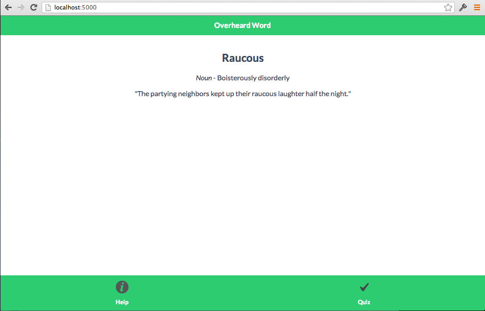

## Lab #6

Have you ever worked with [Rail's Asset Pipeline](http://guides.rubyonrails.org/asset_pipeline.html) before? In short, the asset pipeline

>provides a framework to concatenate and minify or compress JavaScript and CSS assets. It also adds the ability to write these assets in other languages such as CoffeeScript, Sass and ERB.

The good news is that the Asset Pipeline isn't limited to Rails -- you can add one to a Node app easily! 

For this lab, we'll be using a Node module dubbed `asset-pipeline`. But before we do that, let's do the familiar steps we've done a few times now. Change directories into the `lab6` directory and type

```
$> npm install
```

Open up your browser and go to [localhost:5000/](http://localhost:5000/) and once again (again!), you should see:



Now try and swipe through the list of words.....wait, you can't swipe....what's going on ?! Seriously, again??!

Take a look at the `index.html` file in the `views` directory. Yep, no swipe code. Not to worry, we'll add it...as an asset...in CoffeeScript! 

#### Adding a new dependency

But first, you'll need to add the `asset-pipeline` module into your `package.json` file. Accordingly, add this line to the `dependencies` section:

```
 "asset-pipeline":"latest"
 ``` 

This pulls down the _most recent version_ -- you can also pull down a precise version by replacing `latest` with a version number. 

You'll need to run `npm install` again to get this library. 

#### Configuing asset-pipeline

Next, you'll need to add some specialized code in `App.coffee` that configures the asset pipeline. 

```
app.use(require('asset-pipeline')({
    server: app,
    assets: './assets',
    debug: false,
    extensions: ['.js'],
    cache: './public/js'
}))
```

The above code should be added above the `app.set 'view engine', 'html'` line; what's more, this code configures the asset pipeline to look for assets in the `assets` directory. Note, in this case, this pipeline will only handle CoffeeScript files (because we've set that we only want to produce files with `extensions:['.js']` which are, naturally, JavaScript files) and will put the corresponding JavaScripts in the `public/js` directory.

#### Writing an asset

Now all that's left is to write an asset. And what asset would that be? Yes! The swipe code! Here's the _JavaScript_: 

```
$(document).on("pageinit", function(event) {
  $("div.ui-page").on("swipeleft", function() {
    var nextpage;
    console.log("swipeleft invoked");
    nextpage = $(this).next("div[data-role=\"page\"]");
    if (nextpage.length > 0) {
      return $.mobile.changePage(nextpage, "slide", false, true);
    }
  });
  return $("div.ui-page").on("swiperight", function() {
    var prevpage;
    console.log("swiperight invoked");
    prevpage = $(this).prev("div[data-role=\"page\"]");
    if (prevpage.length > 0) {
      return $.mobile.changePage(prevpage, {
        transition: "slide",
        reverse: true
      }, true, true);
    }
  });
});
```

__Question__: Can you make this a CoffeeScript asset? Hint, you should place the resultant `.coffee` file in an `assets` directory that you'll need to create in the root of the project. 

__Question__: Once you've defined that asset, how do you make use of it? Hint: if you named your asset `swipe.coffee` then it'll be called `swipe.js` and it can be referenced via a `script` tag like so: 

```
<script src="swipe.js"></script>
```

Warning though! You will need to add this script _before_ the inclusion of jQuery Mobile; that is, you should add it before this line:

```
<script src="https://d10ajoocuyu32n.cloudfront.net/mobile/1.3.1/jquery.mobile-1.3.1.min.js"></script>
```

Once you've completed these steps, fire the app up (using `foreman start` of course) and if things worked, you should be able to swipe through your jQuery Mobile app!
